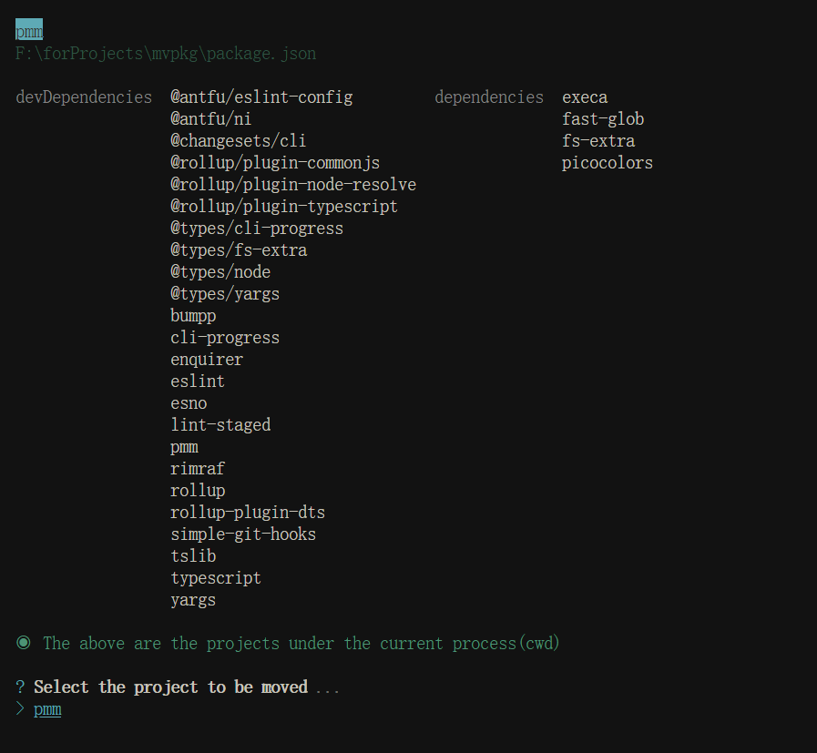
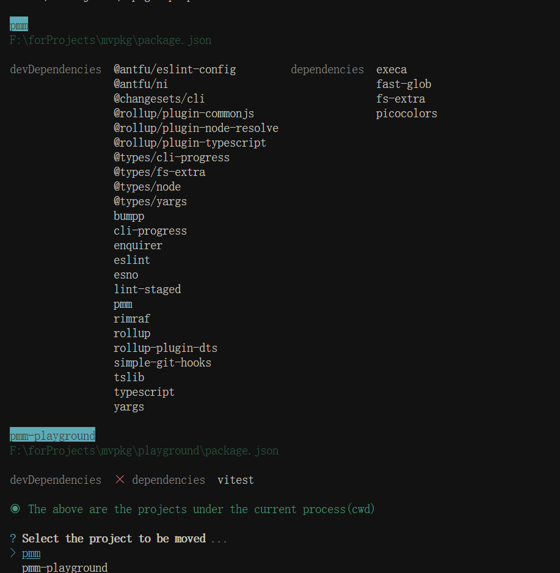
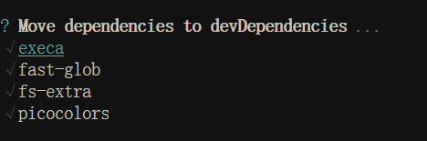
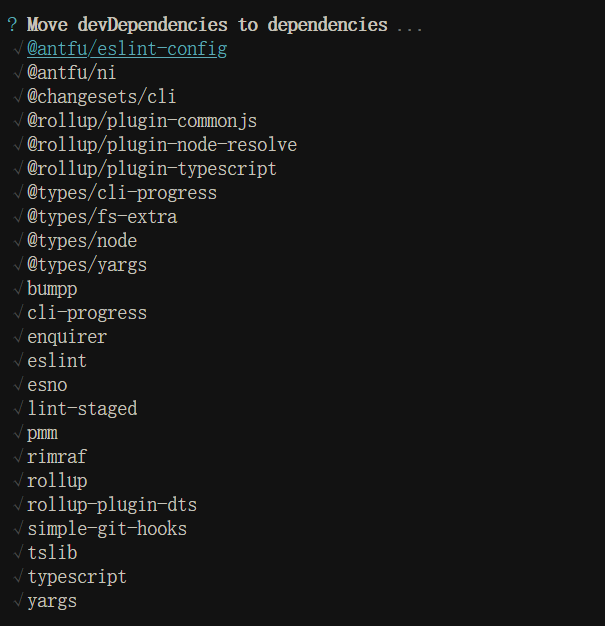

<h1 align="center">⛄ Pmm</h1>
<p align="center">A package.json module manager</p>

<pre align="center">npx <b>pmm</b></pre>

<p align="center">or recursively for <b>monorepos</b></p>

<pre align="center">npx pmm <b>-r</b></pre>


## 📦 Installation

```
# pmm 

pnpm install pmm -D

```

## 🦄 Usage

By default, `npx pmm` or `npx pmm move` only scans the `package.json` of the current command execution path 
<br>
<p align='center'>

</p>

The `-R` or `-r` option can scan packages in the current command execution path and in subdirectories
<br>
<p align='center'>

</p>

Once we have selected the package we want to work on, we can choose how to move the dependencies, which by default is to move the dependencies 
to the devdependencies
<br>
<p align='center'>

</p>

The `-D` or `-d` option can choose move devdependencies to dependencies 
<br>
<p align='center'>

</p>

